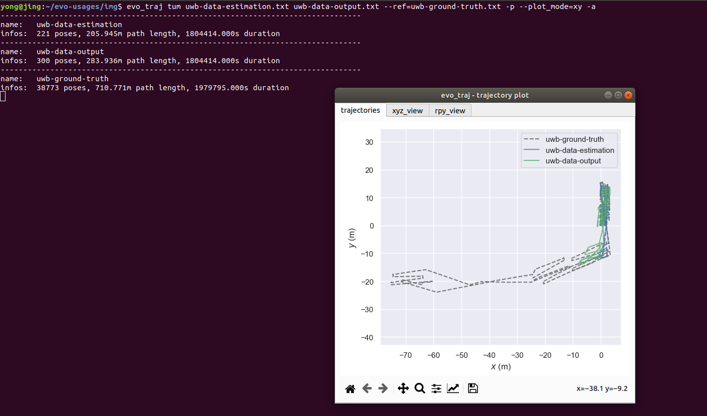
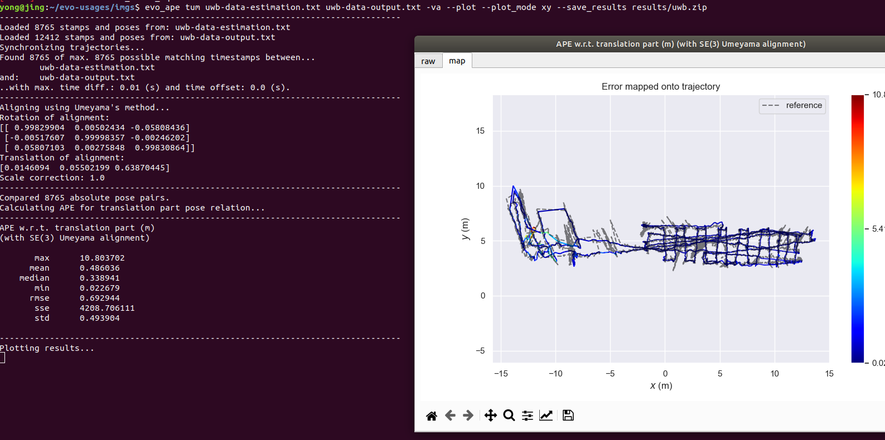
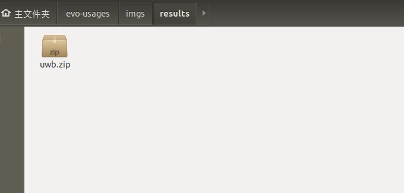
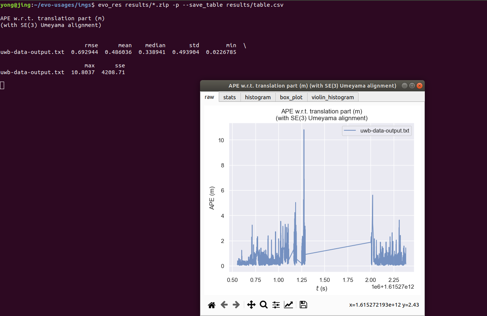

evo是一款用于视觉里程计和slam问题的轨迹评估工具。核心功能是能够绘制相机的轨迹，或评估估计轨迹与真值的误差。支持多种数据集的轨迹格式（TUM、KITTI、EuRoC MAV、ROS的bag），同时支持这些数据格式之间进行相互转换。参考：[视觉里程计的轨迹评估工具：evo](https://zhuanlan.zhihu.com/p/107125186)

#### 一 evo安装

打开终端，输入：

pip install evo --upgrade --no-binary evo


evo常用指令：

Metrics:

- evo_ape        - absolute pose error 绝对轨迹误差
- evo_rpe         - relative pose error  相对轨迹误差


Tools:

- evo_traj       -tool for analyzing,plotting or exporting one or more trajectories
- evo_res       -tool for compare one or multiple result files from evo_ape or evo_rpe
- evo_fig       -(experimental)tool for re-opening serialized plots(saved with --serialize_plot)
- evo_config  -tool for global settings and config file manipulation


#### 二 Examples for evo usages

- plot multiple trajectories 

  ```
  evo_traj tum uwb-data-estimation.txt uwb-data-output.txt --ref=uwb-ground-truth.txt -p --plot_mode=xy -a
  ```
  
  
  
  


- calculate  the absolute pose error for two trajectories using evo_ape(uwb-data-estimation is the reference (groundtruth))

  ```
  evo_ape tum uwb-data-estimation.txt uwb-data-output.txt -va --plot --plot_mode xy --save_results results/uwb.zip
  ```

  

  

  

- evo_res  can be used to compare multiple result files from the metrics, ie.:

  - print infos and statistics(defult)

  - plot the results

  - save the statistics in a table

    ```
    evo_res results/*.zip -p --save_table results/table.csv
    ```

    

    

    

    

    


